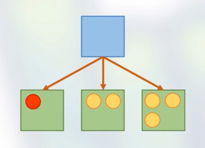
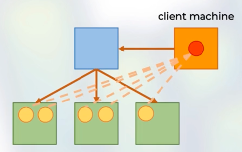

### Spark Cluster Manager

- one node manages the state of the cluster the others do the work
- communicate via driver/worker processes
- It has three Custer manager
  - Yarn
  - Standalone
  - Mesos

### Spark Driver/Cluster Driver
- manages the state of the stages/tasks of the application
- interfaces with the cluster manager

### Spark Executor/ Cluster Executor
- run the tasks assigned by the Spark driver
- report their state and results to the driver

### Execution Mode

#### Cluster
- the Spark driver is launched on a worker node
- the cluster manager is responsible for Spark processes

#### Client
- the Spark driver is on the client machine
- the client is responsible for the Spark processes and state management
- Assume we have clean cluster, then if we want to deploy the spark application
in client mode, then we need the client machine on which we need to run the command.
So the client machine will actually talk to the cluster manager and after that, it will spawn the spark driver on the client machine
not the actual cluster and then the spark manager actually take care to spin the spark executors on the worker nodes.

#### local
- the entire application runs on the same machine
- So you have as much parallelism as much you have cores on the machine/computer

### Deploy Modes
- cluster: driver + executors launched on cluster
- client: driver launched on client, executors on cluster
- local: everything on the same machine