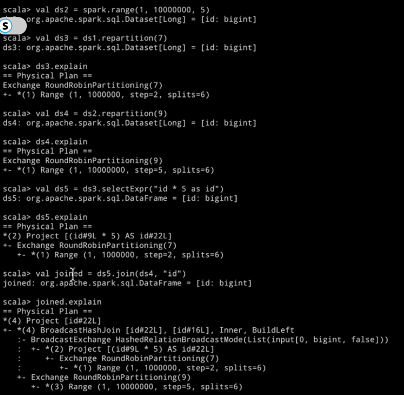

## How Spark Runs on Cluster

- A job has multiple stages and stage has multiple task 
- stage - series of computations between shuffles
- Shuffles are exchange of data in between the spark nodes
- task is a unit of computation per partition 
- DAG(Directed Acyclic Graph) = graph of RDD dependencies


Spark counts the number of stages since the start of the application. That is why we see so many job IDs
```
rdd1.repartition (23).count
```
It creates the two stages:
- one is to read the rdd1 which has 6 partitions
- 2nd is partitioning the rdd in 23 partition and take the count of each partition
That is why it has 29 tasks to do


| `rdd1.toDf.show`         | `spark.range(1, 100000, 2).show` |
|--------------------------|:--------------------------------:|
|   |           |

Whenever you are working with high level API with dataframes or datasets, we dont have too much control what steps 
spark will create whenever it computes


It is called a **physical plan**, it describes all the operations that spark will do to actually compute this dataset


- When ds3 comes with reparrtition 7 then in the physical plan 
we get the round Robin partitioning method which is the method of shuffling
the data
- In ds5 when selectExpr is implemented then
  - '(1)' It created a Range then repartition it by 
    round robin method
  - (2) It project the selectExpr where #9L is the identifier of column id
    and new column id created with identifier #22L
- Before joining the dataset with ds4 it repartitioned again
  using broadcast exchange method

##### Note: These numbers in the bracket shows the steps of spark in which order it will execute the physical plan


- Exchange **SinglePartition** means repartitioning the dataset
again because of the aggregation and HashAggregate to implement which
function are we using for the aggragation.
- When you do show action then it will create two jobs
  - 1st is with the 1st and 2nd step i.e splits = 6 and then Round Robin
    partitioning(7)
  - 2nd is step (3) and then Exchange SinglePartition

First Job DAG

Second job DAG


`explain(true)` gives you all the plans which spark thinks before
executing the job and brings out the most optimized plan


**Scan** is for Parallelize

**SerializeFromObject** means converting the RDD to dataframe

 Figure1: Physical Plan
 Figure2: DAG of the physical plan

- In Stage 16 and 17 is the creation of RDD and transforming them to Dataframe
- In stage 18 and 19 is actually doing the repartition of both the dataframe and stage 19 we have
  WholeCodegen because of Project(selectExpr(value * 5 as value)) which is done at the same stage
  That is why we have 3 operations in stage 19
- In stage 20 - we have exchange first in which we are doing shuffle and no. of partition
  by default is 200 and both df is doing exchange HashPartitioning(200)
- Because join is happening in some numerical column so spark decide to do sort first on both
  the column so that it will be easier and faster to join the dataframe, then it will do the
  join and then it will do the repartition.That's why we have 200 task in stage 20
- In final stage we have SinglePartition so thats why we have exchange and then its summing the
  value


